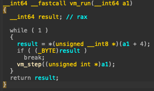

# 🔁 Reversing Challenge

## 🏷️ Name: [Alien Saboteur](https://app.hackthebox.com/challenges/484)

## 🔥 Difficulty: Medium

## 🎯 Points: 0

## ⏳ Status: 🟥 Retired

## 📜 Challenge Description: 
> You finally manage to make it into the main computer of the vessel, it&#039;s time to get this over with. You try to shutdown the vessel, however a couple of access codes unknown to you are needed. You try to figure them out, but the computer start speaking some weird language, it seems like gibberish...

## 📂 Provided Files:
- **Filename:** `Alien_Saboteur.zip`

- **SHA-256 Hash:** `f3aedbaf515cb680fd8aefe06e7831a53b5da86e8bba1df904712a143940e333`

# 🚀 Methodology

### 🔁 1️⃣ Decompiling & Analyzing the Binary

We are provided two files:

- **bin** : data
- **vm** : ELF 64-bit LSB pie executable, x86-64, version 1 (SYSV), dynamically linked, interpreter /lib64/ld-linux-x86-64.so.2, BuildID[sha1]=10fb238b19d3a82b46536b51e47396525086a09c, for GNU/Linux 3.2.0, not stripped

The filename `vm`, and the associated `bin` file seem to heavily hint that this is some sort of Virtual Machine. 

---

Checking the `main` function, we have a pretty straight forward VM setup:


The `bin` file is opened, content read and memory allocated for its content. 

- It uses `ftell` to determine the size of the file, and saves it to `size`. 
- It allocates `size` bytes of memory to `ptr`
- It reads the content of the file and saves it to `ptr`
- Closes the file
- Runs vm_create(`ptr`, `size` (the size of the file))


---

#### vm_create


- `v3` is a pointer to a memory block with `0xA8` (168 bytes) of memory allocated using `malloc`.
- `*(_DWORD *)v3 = 0` sets the first 4 bytes (at byte offset `0x00`) of the block to zero,  this is equivalent to writing `v3[0] = 0` if treating `v3` as an `int32_t*`.
- `v3[4] = 0` sets the single byte at offset `0x04` to zero,  this modifies only the lowest byte of the second 32-bit word.
- `*((_DWORD *)v3 + 40) = 0` sets 4 bytes at index `0xA0` (index 40 ) which clears that `int32_t` field.

---

### In **byte offset** terms, this translates to:

```python
a1 = open('bin','rb').read()
a2 = len(a1)

#*(_DWORD *)v3 = 0
v3 = bytearray(0xA8) # Simulate malloc(0xA8) = 168 bytes

#*result = 0 (first 4 bytes)
v3[0:4] = [0, 0, 0, 0]

#v3[4] = 0
v3[4] = 0

#*((_DWORD *)v3 + 40) = 0
v3[0xa0:0xa0+4] = [0, 0, 0, 0]

```

- `memset(v3 + 8, 0, 0x80)` starts zeroing memory at byte offset `0x08`, setting `128` bytes to zero.

```python
#memset(v3 + 8, 0, 0x80) → zero 128 bytes from offset 0x08
v3[0x08:0x08 + 0x80] = [0] * 0x80
```

- `*((_QWORD *)v3 + 18) = calloc(0x10000, 1);`  
  Allocates **64KB (0x10000 bytes)** of zeroed memory and stores the pointer at offset `18 * 8 = 0x90` (bytes into `v3`).  
  → This acts as the **VM's program memory**

- `memcpy(*((void **)v3 + 18), (const void *)(a1 + 3), a2 - 3);`  
  Copies `a2 - 3` bytes from the input file buffer (`a1 + 3`) into the program memory allocated above.  
  → This loads the bytecode into memory, **It skips the first 3 bytes** (possibly a header or magic value).

- `*((_QWORD *)v3 + 19) = calloc(0x200, 4);`  
  Allocates **8192 bytes** (`0x200 * 4`) and stores the pointer at offset `19 * 8 = 0x98` (bytes into `v3`).  
  → Likely used for the **VM's register file, stack, or scratch space**.


In short we have:

```python
# Simulate heap allocations
heap = {}
# Allocate 64KB for program memory
heap['program_memory'] = bytearray(0x10000)

# Store a pointer (fake label) at offset 18 * 8 = 0x90
# Ensure v3 is big enough (technically already 0xA8, but let's double check)
if len(v3) < 0x98:
    v3 += bytearray(0x98 - len(v3))

v3[0x90:0x98] = list(b'PROGMEM0')  # 8-byte fake pointer label
# memcpy into program memory (skip first 3 bytes of a1)
heap['program_memory'][0:a2 - 3] = a1[3:a2]

# Allocate 2048 * 4 = 8192 bytes for register/stack
heap['register_memory'] = bytearray(0x200 * 4)

# Store another fake pointer at offset 19 * 8 = 0x98
v3[0x98:0xA0] = list(b'REGREG00')  # 8-byte fake pointer label, this points to the register 

```

*Also these python 'translations' are not to be taken literally, they just help me understand what's going on better*

The output (`v3`) is then passed to `vm_run`. 

#### vm_run




Here, `a1` represents the **vm structure** created by **vm_create** (`v3`). 

- `result = *(unsigned __int8 *)(a1 + 4);` 
    - Read **one byte** at offset **4** from the base pointer (a1)

- `if ((_BYTE)result)  break;`
    - If the byte is NOT **zero**, break the loop

- `vm_step((unsigned int *)a1);`
    - Calls the `vm_step` function to execute one instruction 


In other words:

```python
def vm_run(v3):
    while True:
        result = v3[4]  # read 1 byte at offset 0x04
        if result != 0:
            break
        vm_step(v3)
    return result
```

#### vm_step


**a1** -> is the pointer to the **VM State** `v3`

- `v2 = *(_BYTE *)(*((_QWORD *)a1 + 18) + *a1);`
    - We previously saw that `*((_QWORD *)a1 + 18)` is where the **program memory pointer** is stored
    - *a1: - This is the value at a1[0], the **instruction pointer** 
    - Basically, `v2 = program_memory[PC];` or `v2 = program_memory[v3[0]]`
    - `v2` is the **opcode**

- If `v2` is bigger than `0x19` (25), it breaks, prints "dead" and exits the program completely
- The VM looks up the **corresponding function** in the `original_ops` **function pointer table**, using the **opcode** as an index.
- It then calls that function, passing `a1` (aka `v3` aka the VM State) as the argument. 


```python

def vm_step(v3):
    pc = int.from_bytes(v3[0:4], 'little')  # program counter at offset 0x00
    program_memory = heap['program_memory']  # get actual memory
    opcode = program_memory[pc]  # fetch opcode at PC

    if opcode > 0x19:
        print("dead")
        exit(0)

    return original_ops[opcode](v3)  # dispatch to handler
```

---

### ⚙️2️⃣ VM Opcodes and Their Handlers


Each opcode maps to a function, there are **25** functions, which explains why it would return `dead` if the opcode is bigger than 25. 

We have:

```python

original_ops = ["vm_add","vm_addi","vm_sub","vm_subi","vm_mul","vm_muli","vm_div","vm_cmp","vm_jmp","vm_inv","vm_push","vm_pop","vm_mov","vm_nop","vm_exit","vm_print","vm_putc","vm_je","vm_jne","vm_jle","vm_jge","vm_xor","vm_store","vm_load","vm_input"]

```

Going into every single one of the functions would take a while, but essentially, the names of the functions represent exactly what it does in assembly. 

For instance, vm_add:


Where a1 is the `v3` generated above

```python

def vm_add(a1):
    pc = int.from_bytes(a1[0:4], 'little')
    program_memory = heap['program_memory'] # (*((_QWORD *)a1 + 18))

    reg1_idx = program_memory[pc + 2] + 2
    reg2_idx = program_memory[pc + 3] + 2
    dest_idx = program_memory[pc + 1] + 2

    v2 = a1[reg1_idx]
    v3 = a1[reg2_idx]
    a1[dest_idx] = v2 + v3

    new_pc = pc + 6
    a1[0:4] = int(new_pc).to_bytes(4, 'little')
    return a1
```


Each **original_op** is a function, that is distinct in the way it processes information. But the important thing is that each instruction is `6 bytes long`. The first byte represents the opcode. I wrote a python code to disassemble it:


```python
from pwn import *
from struct import unpack

OPCODES = {0: 'add', 1: 'addi', 2: 'sub', 3: 'subi', 4: 'mul', 5: 'muli', 6: 'div', 7: 'cmp', 8: 'jmp', 9: 'inv', 10: 'push', 11: 'pop', 12: 'mov', 13: 'nop', 14: 'exit', 15: 'print', 16: 'putc', 17: 'je', 18: 'jne', 19: 'jle', 20: 'jge', 21: 'xor', 22: 'store', 23: 'load', 24: 'input'}


def disassemble(bytecode):
    ip = 0
    outputs = []
    while ip + 6 <= len(bytecode):
        chunk = bytecode[ip:ip+6]
        opcode = chunk[0]
        mnemonic = OPCODES.get(opcode, f'unk_{opcode:02x}')
        print(f"{ip:04x}:", end=' ')

        if mnemonic in {'add', 'sub', 'mul', 'div', 'xor'}:
            print(f"{mnemonic} r{chunk[1]}, r{chunk[2]}, r{chunk[3]}")
            outputs.append((mnemonic,chunk[1],chunk[2],chunk[3]))
        elif mnemonic in {'addi', 'subi', 'muli'}:
            print(f"{mnemonic} r{chunk[1]}, r{chunk[2]}, {chunk[3]}")
            outputs.append((mnemonic,chunk[1],chunk[2],chunk[3]))
        elif mnemonic == 'mov':
            imm = u32(chunk[2:6])
            print(f"mov r{chunk[1]}, {imm}")
            outputs.append((mnemonic,chunk[1],imm))
        elif mnemonic in {'push', 'pop', 'input', 'putc', 'print'}:
            if mnemonic == 'putc':
                print(f"{mnemonic} {chr(chunk[1])}")
                outputs.append((mnemonic,chr(chunk[1])))
            else:
                print(f"{mnemonic} r{chunk[1]}")
                outputs.append((mnemonic,chunk[1]))
        elif mnemonic in {'je', 'jne', 'jle', 'jge'}:
            r1 = chunk[1]
            r2 = chunk[2]
            target = u16(chunk[3:5]) * 6
            print(f"{mnemonic} r{r1}, r{r2}, {target}")
            outputs.append((mnemonic,r1,r2,target))
        elif mnemonic == 'jmp':
            reg = chunk[2]
            print(f"jmp r{reg}")
            outputs.append((mnemonic,reg))
        elif mnemonic == 'inv':
            sysno = chunk[1]
            argc = chunk[2]
            print(f"inv {sysno} ({argc} args from stack)")
            outputs.append((mnemonic,sysno,argc))
        elif mnemonic == 'cmp':
            print(f"cmp r{chunk[2]}, r{chunk[3]}")
            outputs.append((mnemonic,chunk[2],chunk[3]))
        elif mnemonic == 'load':
            print(f"load r{chunk[1]}, r{chunk[2]}")
            outputs.append((mnemonic,chunk[1],chunk[2]))
        elif mnemonic == 'store':
            print(f"store r{chunk[1]}, r{chunk[2]}")
            outputs.append((mnemonic,chunk[1],chunk[2]))
        elif mnemonic in {'nop', 'exit'}:
            print(mnemonic)
            outputs.append((mnemonic,-1))
        else:
            outputs.append(('db',chunk))
            print(f"db {chunk.hex()}")

        ip += 6
    return outputs


def reassemble_strings_and_bytes(outputs):
    output_items = []
    i = 0
    while i < len(outputs):
        opcode = outputs[i][0]
        if opcode in ('putc', 'db'):  # <-- check both putc and db
            start_i = i
            outstring = '' if opcode == 'putc' else b''
            while i < len(outputs) and outputs[i][0] in ('putc', 'db'):
                outstring += outputs[i][1]
                i += 1
            output_items.append((start_i,(opcode, outstring)))
        else:
            output_items.append((i, outputs[i]))
            i += 1
    return output_items

vm_file = open('bin','rb').read()[3:] #Skip the first 3 bytes because they're like a header
outputs = disassemble(vm_file)
outputs = reassemble_strings_and_bytes(outputs)
#In this case the NOPs would be the ('add', 0, 0, 0) instructions, which we can remove
outputs = [v for v in outputs if v[1] !=  ('add', 0, 0, 0) ]
for v in outputs:
    print(v)

```

### 🔍 2️⃣ Understanding the Logic Flow

The first part of the disassembly, shows that the program expects us to provide a `keycode`: 

#### 1. Input 
```
(0, ('putc', '[Main Vessel Terminal]\n< Enter keycode \n> ')),
(42, ('mov', 30, 4000)),
(43, ('mov', 28, 0)),
(44, ('mov', 29, 17)),
(45, ('input', 25)),
(46, ('store', 30, 25)),
(47, ('addi', 30, 30, 1)),
(48, ('addi', 28, 28, 1)),
(49, ('jle', 28, 29, 270)),
```

So, our input is saved at address **4000**, which is what register `30` is set to. 
A counter for **17 bytes** is set, and our input is stored into **memory [4000]**.  
Memory in this case is in the binary itself. If the opcode is bigger than 0x19 (25), it breaks. 


#### 2. Comparison with hardcoded value 

```(50, ('mov', 30, 4100)),
(51, ('mov', 31, 4000)),
(52, ('mov', 28, 0)),
(53, ('mov', 29, 10)),
(54, ('mov', 27, 169)),
(55, ('mov', 23, 0)),
(56, ('load', 25, 30)),
(57, ('load', 24, 31)),
(58, ('xor', 25, 25, 27)),
(59, ('je', 25, 24, 468)),
(60, ('putc', 'Unknown keycode!\n')),
(77, ('exit', -1))
```

Our input is the compared to a hardcoded value at `memory[4100]`.

At line **54**, the constant `169` is loaded into register `27`. 
The bytes from the hardcoded value, are loaded into register `25` (line **56**) and xored with the value in register `27` (line **58**). Basically, the bytes at memory[4100:4100+17] are xored with `169`:

```python

xored_keycode = vm_file[4100:4100+17]
keycode = xor(xored_keycode,bytes([169]))
print(keycode.decode())
#c0d3_r3d_5hutd0wn
```

If our input doesn't match, it fails: 

```
 (78, ('addi', 30, 30, 1)),
 (79, ('addi', 31, 31, 1)),
 (80, ('addi', 28, 28, 1)),
 (81, ('jle', 28, 29, 336)),
 (82, ('mov', 15, 0)),
 (83, ('push', 15)),
 (84, ('push', 15)),
 (85, ('push', 15)),
 (86, ('inv', 101, 3)),
 (87, ('mov', 16, 0)),
 (88, ('je', 31, 16, 648)),
 (89, ('putc', 'Terminal blocked!\n')),
 (107, ('exit', -1))
```

Secondly, we'll notice that there's a large `db` block:

`b'UyEEEEUeEEEEU\x00EEEEU+EEEEU1EEEEU EEEEU7EEEEUeEEEEU6 ...`


Technically, this opcode would've been bigger than `0x19`, and it should've stopped, butttt .... 

Before this block, we have the instructions:
1. `112, ('mov', 27, 69)` -  it's loading constant **69** into register **27**
2. `114, ('xor', 25, 25, 27)` -  it's xoring the loaded byte with the value inside register **27**
3. `115, (store 30,25)` - it's saving it back

This means, we need to xor that block, and potentially disassemble it again. We can patch it directly and at the same time remove the `('add', 0, 0, 0)` instructions because they are basically NOPs. 

```python
memory = bytearray(vm_file)
registers = {}
registers[30] = 119
registers[30] = registers[30] * 6
registers[28] = 0
registers[29] = 1500
registers[27] = 69
# Now simulate the loop:
while registers[28] < registers[29]:
    registers[25] = memory[registers[30]]      # load
    registers[25] = operator.xor(registers[27],registers[25])             # xor
    memory[registers[30]] = registers[25]      # store
    registers[30] += 1                         # addi
    registers[28] += 1     

#(118, ('jle', 28, 29, 678)) << This is the instruction after 

```
We can now disassemble the rest of the memory:

```python

patched_memory = disassemble(memory)
patched_memory = [x for x in reassemble_strings_and_bytes(patched_memory) if ('add', 0, 0, 0) not in x]
patched_memory
```

We then enter **Phase 2:**

---

### 3️⃣ Reversing the permutation / XOR encryption

The full assembly code (until the final verification) looks like this

#### 1. Input secret
```
    (119, 714, ('putc', '< Enter secret phrase\n> ')),
    (143, 858, ('mov', 30, 4400)),
    (144, 864, ('mov', 28, 0)),
    (145, 870, ('mov', 29, 36)),
    (146, 876, ('input', 25)),
    (147, 882, ('store', 30, 25)),
    (148, 888, ('addi', 30, 30, 1)),
    (149, 894, ('addi', 28, 28, 1)),
    (150, 900, ('jle', 28, 29, 876))
```

- Prints **"< Enter secret phrase >"**. 
- Sets memory adress **4400** to store the input
- Sets `('mov', 28, 0), ('mov', 29, 36)` - expects 36 characters
- Reads the input and will save it at `4400` 

#### 2. Decryption/Permutation Loop

```
 (151, 906, ('mov', 28, 0)),
 (152, 912, ('mov', 29, 35)),
 (153, 918, ('mov', 30, 4400)),
 (154, 924, ('mov', 31, 4500)),
 (155, 930, ('mov', 26, 0)),
 (156, 936, ('mov', 27, 35)),
 (157, 942, ('load', 20, 30)),
 (158, 948, ('load', 21, 31)),
 (159, 954, ('push', 20)),
 (160, 960, ('pop', 19)),
 (161, 966, ('mov', 18, 4400)),
 (162, 972, ('add', 18, 18, 21)),
 (163, 978, ('load', 17, 18)),
 (164, 984, ('store', 30, 17)),
 (165, 990, ('store', 18, 19)),
 (166, 996, ('addi', 26, 26, 1)),
 (167, 1002, ('addi', 30, 30, 1)),
 (168, 1008, ('addi', 31, 31, 1)),
 (169, 1014, ('jle', 26, 27, 942)),
 (170, 1020, ('mov', 30, 4400)),
 (171, 1026, ('mov', 31, 4600)),
 (172, 1032, ('mov', 26, 0)),
 (173, 1038, ('mov', 27, 35)),
 (174, 1044, ('load', 20, 30)),
 (175, 1050, ('push', 31)),
 (176, 1056, ('pop', 15)),
 (177, 1062, ('add', 15, 15, 28)),
 (178, 1068, ('load', 16, 15)),
 (179, 1074, ('xor', 20, 20, 16)),
 (180, 1080, ('store', 30, 20)),
 (181, 1086, ('addi', 26, 26, 1)),
 (182, 1092, ('addi', 30, 30, 1)),
 (183, 1098, ('jle', 26, 27, 1044)),
 (184, 1104, ('addi', 28, 28, 1)),
 (185, 1110, ('jle', 28, 29, 918))
```

This looks absolutely horrible but it's not as bad as it looks:


If we were to mimic the logic in Python we would have more or less the equivalent:

```python
registers = {}
registers[30] = 4400
registers[28] = 0
registers[29] = 36
for b in user_input:
    memory[registers[30]] = b
    registers[30] += 1
    registers[28] += 1

stack = []
# PHASE 2: Scramble phase (using secret_table at 4500)
registers[28] = 0
registers[29] = 35
while registers[28] <= registers[29]:
    registers[30] = 4400
    registers[31] = 4500
    registers[26] = 0
    registers[27] = 35


    while registers[26] <= registers[27]:
        registers[20] = memory[registers[30]]
        registers[21] = memory[registers[31]]
        
        stack.append(registers[20])
        registers[19] = stack.pop()
        
        registers[18] = 4400
        registers[18] += registers[21]
        
        registers[17] = memory[registers[18]]
        
        memory[registers[30]] = registers[17]
        memory[registers[18]] = registers[19]
        
        registers[26] += 1
        registers[30] += 1
        registers[31] += 1

    # PHASE 3: XOR phase (using xor_key at 4600)
    registers[30] = 4400
    registers[31] = 4600
    registers[26] = 0
    registers[27] = 35

    while registers[26] <= registers[27]:
        registers[20] = memory[registers[30]]
        
        stack.append(registers[31])
        registers[15] = stack.pop()
        registers[15] += registers[28]
        
        registers[16] = memory[registers[15]]
        registers[20] = operator.xor(registers[20], registers[16])
        
        memory[registers[30]] = registers[20]
        
        registers[26] += 1
        registers[30] += 1

    registers[28] += 1  # Outer block counter after xor phase

```

After that, the VM compares the output with hardcoded bytes in memory:

```
 (73, 438, ('mov', 30, 4400)),
 (74, 444, ('mov', 31, 4700)),
 (75, 450, ('mov', 26, 0)),
 (76, 456, ('mov', 27, 35)),
 (77, 462, ('load', 15, 30)),
 (78, 468, ('load', 16, 31)),
 (79, 474, ('je', 15, 16, 1206)),
 (80, 480, ('putc', 'Wrong!\n')),
 (87, 522, ('exit', -1)),
 (88, 528, ('addi', 26, 26, 1)),
 (89, 534, ('addi', 30, 30, 1)),
 (90, 540, ('addi', 31, 31, 1)),
 (91, 546, ('jle', 26, 27, 1140)),
 (92, 552, ('putc', 'Access granted, shutting down!\n')),
 (123, 738, ('exit', -1))
 ```

```python
assert memory[4400:4400+36] == memory[4700:4700+36]
```

### ⚡4️⃣ Reversing the permutation/XOR logic

Basically, we need to reverse the logic of the vm. The encryption logic is :

To put it simply, without all the registers/memory stuff:

```python

def scramble_and_xor(user_input, permutation_table, xor_key):
    user_input = bytearray(user_input)  
    for outer in range(36):  # Big outer loop (r28)
        # Phase 1: Scrambling
        for i in range(36):
            current_value = user_input[i]
            scramble_offset = permutation_table[i]
            scramble_address = 0 + scramble_offset 
            swap_value = user_input[scramble_address]
            
            # Swap
            user_input[i], user_input[scramble_address] = swap_value, current_value
        user_input = bytearray(xor(user_input, xor_key[outer]))
    return user_input


```

First of all, let's find the constant values:


```python

final_secret = memory[4700:4700+36]
perm_table = memory[4500:4500+36]
xor_key = memory[4600:4600+36]

#Then, we simply need to reverse the logic:

def unscramble_and_unxor(expected, permutation_table, xor_key):
    user_input = bytearray(expected)  
    for outer in reversed(range(36)): 
        # UNXOR
        user_input = bytearray(xor(user_input, xor_key[outer]))
        # Unscramble (reverse swaps) and reverse rder of swaps!
        for i in reversed(range(36)):
            scramble_offset = permutation_table[i]
            scramble_address = scramble_offset
            user_input[i], user_input[scramble_address] = user_input[scramble_address], user_input[i]
    return user_input


flag =  unscramble_and_unxor(final_secret,perm_table,xor_key)
print(flag.decode())
#HTB{5w1rl_4r0und_7h3_4l13n_by73c0d3}
```

In addition to the above, I have also added three files in this repo:

- [solve_flag.py](solve_flag.py) - This just solves directly for the flag
- [solve_mem.py](solve_mem.py) - This includes the disassembly, and solves for the flag as well
- [vm_emulator.py](vm_emulator.py) - Emulates the VM in Python, and prints the instructions if 'disassembly' is enabled. 


**🚩 Final Flag:** `HTB{5w1rl_4r0und_7h3_4l13n_by73c0d3}`

