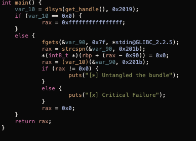
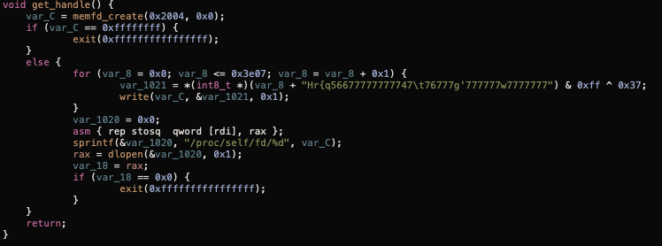
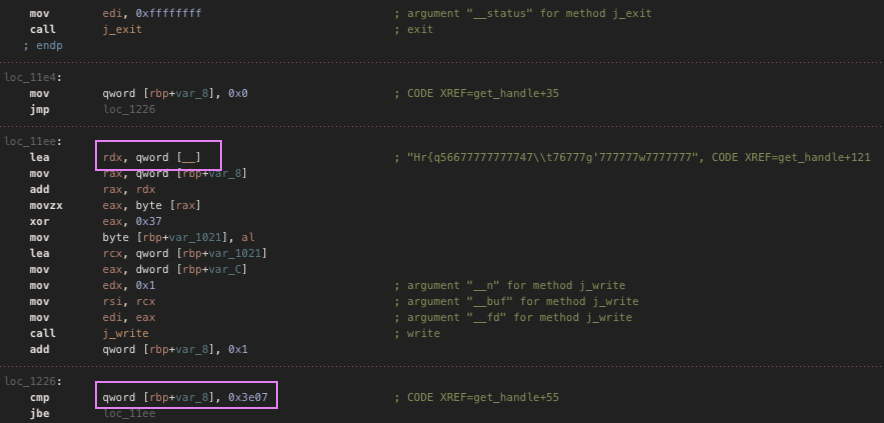
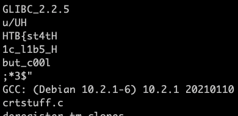
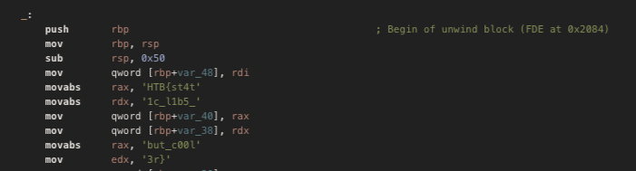

# 🔁 Reversing Challenge

## 🏷️ Name: [BioBundle](https://app.hackthebox.com/challenges/601)

## 🔥 Difficulty: Medium

## 🎯 Points: 0

## ⏳ Status: 🟥 Retired

## 📜 Challenge Description: 
> We&#039;ve obtained a sample of zombie DNA. Can you extract and decrypt their genetic code - we believe we can use it to create a cure...

## 📂 Provided Files:
- **Filename:** `biobundle`

- **SHA-256 Hash:** `63cdb3104f6f1d693c1a43ce18fe5b98cef839a90017d490d4b39fa02b0a1189`

# 🚀 Methodology

### 🔁 1️⃣ Decompiling & Analyzing the Binary

First things first:

```
file biobundle
```

```ELF 64-bit LSB pie executable, x86-64, version 1 (SYSV), dynamically linked, interpreter /lib64/ld-linux-x86-64.so.2, BuildID[sha1]=0ff6e374d4953a88af400e872f4df8d48fa5472e, for GNU/Linux 3.2.0, not stripped```


- **64-bit**
- **not stripped** --> very good news, the binary still contains the symbols !! 


The main function:
1. Reconstructs a valid ELF binary from obfuscated bytes.

2. Loads it into memory using memfd_create, write, and dlopen.

3. Finds a function pointer inside it with dlsym.

4. Reads input, processes it, and calls the loaded function with that input.

5. Prints success/failure based on return value.



We know this because main function first calls get_handle():



### 🔍 2️⃣ Understanding the Logic Flow

The pseudo-code is a bit misleading, we could assume that it does:

```python
import operator

var_1021 = [operator.xor(ord(x),0x37) for x in "Hr{q56677777777747\t76777g'777777w7777777"]
print(bytes(var_1021))
#b'\x7fELF\x02\x01\x01\x00\x00\x00\x00\x00\x00\x00\x00\x00\x03\x00>\x00\x01\x00\x00\x00P\x10\x00\x00\x00\x00\x00\x00@\x00\x00\x00\x00\x00\x00\x00'
```

but in reality, if we check the Assembly version:



It xors 0x3e07 bytes at symbol '__'.

```python
from pwn import *

elf = ELF('./biobundle')

addr = elf.symbols['__']
byte_data = elf.read(addr,0x3e07)

xored_elf = xor(byte_data,bytes([0x37]))

with open('bundle_1.elf','wb') as of:
    of.write(xored_elf)

```

### ⚡ 3️⃣ Analyzing the Inner Elf

Loading the file with ELF in python gives me an error 🤔🤔🤔. Makes sense since it's dynamically loaded, and dlopen() doesn't need section headers. 

Running file:

```
bundle_1.elf: ELF 64-bit LSB shared object, x86-64, version 1 (SYSV), dynamically linked, missing section headers at 15816
``` 

if we run strings on the file we have some flag data:




Opening the file in Hopper and converting the values to Characters, we have the flag:





**🚩 Final Flag:** `HTB{st4t1c_l1b5_but_c00l3r}`
