# 🔁 Reversing Challenge

## 🏷️ Name: [Malception](https://app.hackthebox.com/challenges/309)

## 🔥 Difficulty: Medium

## 🎯 Points: 0

## ⏳ Status: 🟥 Retired

## 📜 Challenge Description: 
> Attackers have infiltrated our domain and poisoned DNS records to infect users with a ransomware. We weren&#039;t able to retrieve any artifacts, but we have a packet capture you could use.

## 📂 Provided Files:
- **Filename:** `Malception.zip`

- **SHA-256 Hash:** `d8e9aba9d671f97ffd8582749d3e44cfb029bdeeba0ef1ec3631ea5fadc06ab4`

# 🚀 Methodology

### 🔁 1️⃣ Decompiling & Analyzing the Binary

We're given a PCAP file, which we can explore with Wireshark. I usually start by doing: 

File --> Export Objects --> HTTP 

and we find a Windows Executable 'xQWdrq.exe':

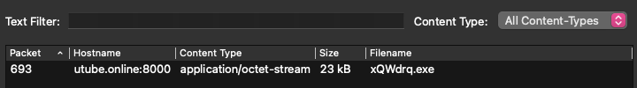

We can save it and analyze it further. 

For Static Analysis, I usually use a mix of [dogbolt](https://dogbolt.org/) and Hopper. Here I used The HexRays decompiled version of the executable, because it gave the cleanest output. 

From the GetGo we see that the Main function is called and starts up WSA. It creates a socket and connects to 'utube.online' on port 31337:

#### 1. C2 Initliazation

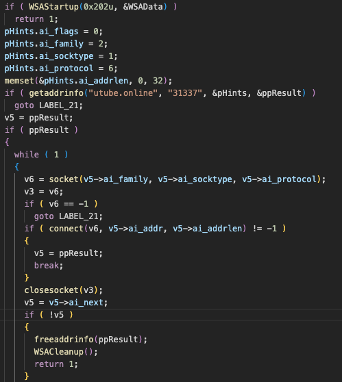

On the side, we can filter the PCAP for `tcp.port == 31337` and we will find that there are 17 packets. 

Next, it does the following

1. Initial Beaconing:
    - the malware connects to a server listening on port 31337
    - it sends the string "z11gj1\n"

2. The C2 sends a response:
    - this is 'buf'

3. The Victim Obfuscates the Host Info:
    - the malware retrieves the victim's domain/computer name and stores it in "Buffer"
    - it xors the 'buf' received with the domain/computer name

4. The victim sends "533_11s4\n" to the server

5. The victim allocates memory for a payload and receives up to 7680 byte from the server. 

```c
  v11 = (char *)VirtualAlloc(0, 0x2710u, 0x1000u, 4u);
  recv(v3, v11, 7680, 0);
```

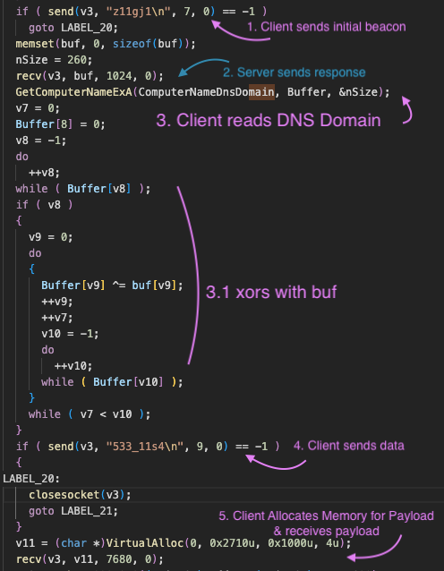

#### 2. RC4 Encryption/Decryption

It then calls `sub_140001010` on `Buffer` (so the xored Hostname with the received data) with `v11` - the received payload.  

`sub_140001010` is basically RC4:


Because:
 
 1. It initialzies an array with values 0 to 255:
```cpp
v9 = v22;
for ( i = 0; i < 256; ++i )
    *v9++ = i;
```
 2. It swaps the values of Sbox `v22` and uses key `a1` cyclically 
```cpp
do
{
    v14 = *v13++;
    v15 = v12++;
    v10 = (unsigned __int8)(v14 + v10 + *(_BYTE *)(v15 % (int)v7 + a1));
    *(v13 - 1) = v22[v10];
    v22[v10] = v14;
}
while ( v12 < 256 );
```

 3. And most importantly:

```cpp
*v17 = v17[v18] ^ v22[(unsigned __int8)(*v19 + v20)]
\\* which in this case is basically 

*dst = src ^ Sbox[(Sbox[i]+Sbox[j])&0xFF]
```

This matches perfectly with known RC4 behavior. 


Therefore, in the PCAP, the first packet sent from `31337` is xored with the HostName, and is used as a **RC4 Key** to decrypt the data following the packet containg **533_11s4\n**. 

In python, we can easily filter for these packets:


```python
import pyshark
from Crypto.Cipher import ARC4


packets = pyshark.FileCapture('capture.pcapng',display_filter='tcp && data.data && tcp.port == 31337')

payload = b''
pre_xor_rc4key = None
for pkt in packets:
    if pkt.tcp.srcport == '31337':
        if not pre_xor_rc4key:
            pre_xor_rc4key = bytes.fromhex(pkt.data.data)
        else:
            payload += bytes.fromhex(pkt.data.data)

```

before decrypting continuing with **RC4 key** we need to find the hostname. Luckily, the PCAP contains kerberos data. Filtering with `kerberos.realm` we find:

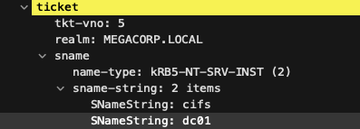


```python
from Crypto.Util.strxor import strxor
import magic

rc4_key = strxor(pre_xor_rc4key,b'MEGACORP')
decrypted_payload = ARC4.new(rc4_key).decrypt(payload)
print(magic.from_buffer(decrypted_payload))
```

**Output**:
```
PE32+ executable (DLL) (console) x86-64 Mono/.Net assembly, for MS Windows, 2 sections
```

Tempting to stop here, but if we look further, it hasn't ran the executable yet. So far it only Decrypted it. 


#### 4. Loading Embedded Resource Payload

The malware locates and loads an embedded resource from its own executable (resource ID 0x65, type 0xA), and decrypts it with the previous derived RC4 key (the one that is xored with the hostname). 

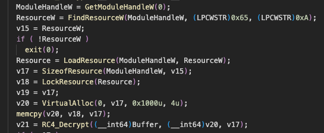

*Side Note - I renamed `sub_140001010` to `RC4_Decrypt`.*

Again, in Python we can retrieve this data:

```python
import pefile

pe = pefile.PE('xQWdrq.exe')

for entry in pe.DIRECTORY_ENTRY_RESOURCE.entries:
    if entry.id == 0xA:
        for res in entry.directory.entries:
            if res.id == 0x65:
                data_rva = res.directory.entries[0].data.struct.OffsetToData
                size = res.directory.entries[0].data.struct.Size
                data = pe.get_memory_mapped_image()[data_rva:data_rva+size]
                decrypted_resource = ARC4.new(rc4_key).decrypt(data)
```

Finally, the decrypted resource (`v21`) is used to patch the decrypted payload (`v12`) starting at offset 3504:

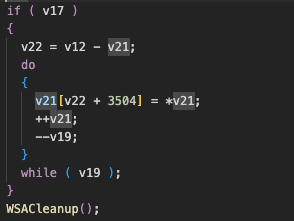


Which in python translates to:

```python

v12 = bytearray(decrypted_payload)
v21 = bytearray(decrypted_resource)
for i in range(len(v21)):
    # Copy each byte from v21[0..v19] into v12[5728 + 3504 + i]
    v12[3504 + i] = v21[i]

```

and we end up with a DotNet executable. The malware then:
- shuts down the Winsock API 
- calls sub_140001980 with patched `v12` with `Buffer`. *remember Buffer is the derived rc4 key*
- executes the patched DotNet file

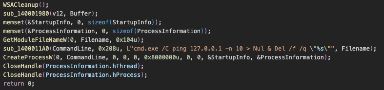


#### 5. sub_140001980

*Renamed sub_140001980 to invoke_donet*

*renamed sub_140002D10 to ConvertAnsiToBSTR*

*renamed sub_140002D00 to HandleError*

*renamed sub_1400011A0 to FormatWideStringSafe*


In short, `sub_140001980` aka `invoke_donet` loads a .NET runtime in-process, injects and executes the in-memory .NET assembly stored in v12.

It uses the COM interfaces from the CLR hosting API to:

- Initialize the .NET CLR :

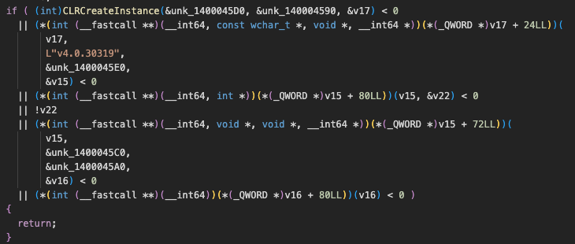

- Load the the decrypved `v12` buffer as a **.NET assembly**:

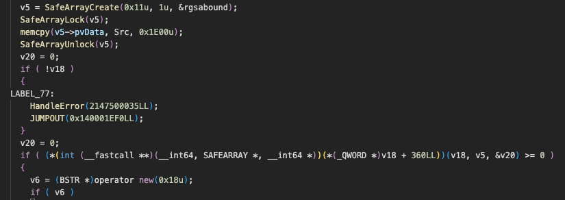


- **Call a method** (EntryPoint) in class `CorpSpace.CorpClass`


After loading the buffer, it instantiates a class CorpSpace.CorpClass:
```cpp
    if ( v6 )
    {
      *(_OWORD *)v6 = 0;
      v6[2] = 0;
      v6[1] = 0;
      *((_DWORD *)v6 + 4) = 1;
      *v6 = ConvertAnsiToBSTR("CorpSpace.CorpClass");
    }
```

and then :

```cpp
(*(int (__fastcall **)(__int64, BSTR, __int64 *))(*(_QWORD *)v20 + 136LL))(v20, *v6, &v19);
```

which corresponds to `Assembly.CreateInstance("CorpSpace.CorpClass")` and calls EntryPoint

```cpp
v8 = SysAllocString(L"EntryPoint");
*v7 = v8;
```

- Finally, it passes the RC4 key as a parameter to EntryPoint:

by first converting to a BSTR and saving it as an argument list:

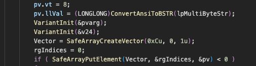


and then calling EntryPoint method with the argument list:

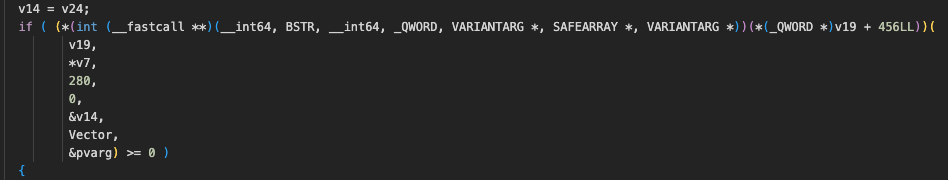


Where:
- v19 is the CorpSpace.Corp.Class instance
- v7 is the **method name** --> EntryPoint
- 280 the Binding Flags
- 0 is the Binder (null)
- &v14 is the target object (null)
- Vector - SAFEARRAY of arguments, which contains the RC4 Key 
- &pvarg - stores the ouptout of the method


After executing the .NET payload, the malware launches a delayed command using cmd.exe and ping to give itself time to exit before deleting its own executable.

```cpp 
  memset(&StartupInfo, 0, sizeof(StartupInfo));
  memset(&ProcessInformation, 0, sizeof(ProcessInformation));
  GetModuleFileNameW(0, Filename, 0x104u);
  FormatWideStringSafe(CommandLine, 0x208u, L"cmd.exe /C ping 127.0.0.1 -n 10 > Nul & Del /f /q \"%s\"", Filename);
  CreateProcessW(0, CommandLine, 0, 0, 0, 0x8000000u, 0, 0, &StartupInfo, &ProcessInformation);
  CloseHandle(ProcessInformation.hThread);
  CloseHandle(ProcessInformation.hProcess);

```


### 🔍 2️⃣ CorpSpace - .NET DLL

We have arrived to Stage 2; the CorpSpace .NET file. 


```python

with open("CorpSpace.dll","wb") as of:
    of.write(bytes(v12))

```

and we can use a .NET decompiler to analyze it. I use CodemerxDecompile. 

CorpSpace - the Namespace contains three classes
 - CorpClass
 - Stego 
 - Graphy

Unfortunately my decompiler didn't manage to decompile Stego. 

Checking CorpClass, which was invoked with the RC4 Key:

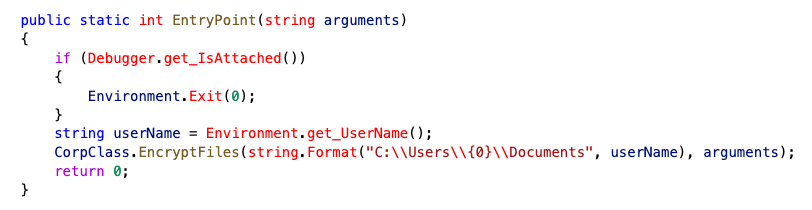

We see that it first checks for a Debugger, and secondly encrypts all the files in the user's Documents directory:

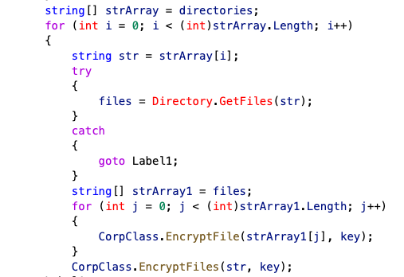

The EncryptFile function is a little bit messy, but breaking it down:

First it generates/encrypts the data:

1. Creates two keys (`str`, `str1`) using the **StegoClass**
2. Creates a key (`numArray`) from an MD5 hash of a random guid.
3. Generates `encrypted content` by encrypting the content of the file with the `numArray` key using **GraphyClass**
4. Generates `encrypted filename` (the filename + `'.enc'`)
5. Encrypts `numArray` with `str` using **StegoClass**
6. Xors `str1` with the `rc4 key`

Then, it connects to TCP Port 31338 and:

1. Concatenates `Encrypted numArray` (Step 5) with `Xored Str1` (Step 6)
2. Sends the length of `Step 1` with New Line delimitor 
3. Receives 1 byte 
4. Sends `Step 1`
5. Receives 1 byte 
6. Xors the  `encrypted filename` with the `rc4 key`
7. Sends the length of `Step 6` with New Line delimitor 
8. Receives 1 byte 
9. Sends the `Step 6`
10. Receives 1 byte 
11. Sends the length of `encrypted content` 
12. Receives 1 byte 
13. Sends `encrypted content` 
14. Sends string 'end' when it's finished


#### GraphyClass

Graphy uses PBKDF2 to derive a Key an IV, using base64 encoded `NumArray` and a hardcoded Salt `15cc7f9903ed0a1a1367171f37312039`. 
It then encrypts the data with AES CBC Mode. 


The only thing we don't know is the Stego Class and how it operates.

But we can process the blocks using the following:

```python

class BlockParser:
    def __init__(self,block):
        self.offset = 0
        self.total_len = len(block)
        self.data = block
    
    def parse_block(self):
        i_bye = self.data[self.offset:].find(b'\n\n') 
        content_len = self.data[self.offset:self.offset+i_bye+1].decode().strip()
        assert content_len.isnumeric()
        content_len = int(content_len)
        self.offset +=i_bye+1
        stream_read = self.data[self.offset:self.offset+1]
        assert stream_read == b'\n'
        self.offset +=1
        content = self.data[self.offset:self.offset+content_len]
        self.offset+=content_len
        if self.total_len-self.offset >3:
            stream_read = self.data[self.offset:self.offset+1]
            self.offset +=1
            assert stream_read == b'\n'
        else:
            stream_read = self.data[self.offset:self.offset+3]
            self.offset +=3
            assert stream_read == b'end'
        return content

    def deserialize_block(self):
        encrypted_keys = self.parse_block()
        enc_filename_xored = self.parse_block()
        encrypted_content = self.parse_block()
        return encrypted_keys,enc_filename_xored,encrypted_content


buffers = []
blocks = []
buffer = b''
for pkt in pyshark.FileCapture('capture.pcapng',display_filter='tcp && data.data && tcp.port == 31338'):
    data = bytes.fromhex(pkt.data.data)
    buffer+=data
    if data == b'end':
        blocks.append(buffer)
        buffers.append(BlockParser(buffer).deserialize_block())
        buffer = b''
```


### ⚡ 3️⃣ Reversing Encryption Process 

We have:
- `str` + (`str1` XOR `rc4 key`)
- `encrypted filename` xor `rc4 key`
- `encrypted content` AES encrypted with PBKDF2 derived key/iv from `numArray`.

We can recover:
- `str1` and `encrypted filename`

```python

import operator

def xor(data: bytes, key: bytes):
    return bytes([operator.xor(b,key[i % len(key)]) for i, b in enumerate(data)])

encrypted_keys,enc_filename_xored,encrypted_content = buffers[0]
encrypted_filename = xor(enc_filename_xored,rc4_key)
print(encrypted_filename.decode())
#C:\Users\rick.a\Documents\Classified\secret.jpg.enc

xored_keys = xor(encrypted_keys,rc4_key)
print(xored_keys)

```

and `str1` is a RSA key!

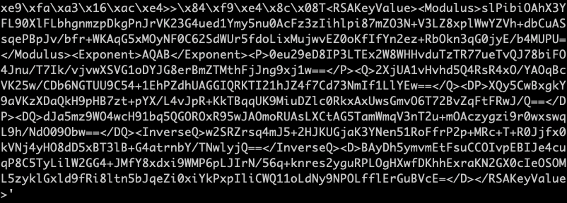

```python
idx = xored_keys.find(b'<RSAKeyValue>')
str1 = xored_keys[idx:]
str0 = encrypted_keys[:idx]
print(len(str0))
#128
```

Well str0 is 128 bytes, therfore it's likely that it's encrypted with the RSA key. 

We can use BeautifulSoup and Cryptodome to check if that's the case:

```python
import base64

from bs4 import BeautifulSoup

from Crypto.PublicKey import RSA
from Crypto.Cipher import PKCS1_v1_5, PKCS1_OAEP
from Crypto.Util.number import bytes_to_long as b2l


def xml2key(xml_bytes):
    soup = BeautifulSoup(xml_bytes,'xml')
    priv_key = {}
    for tag in soup.find('RSAKeyValue').find_all(recursive=False):
        priv_key[tag.name] = b2l(base64.b64decode(tag.text.strip()))
    privkey = RSA.construct((priv_key['Modulus'],priv_key['Exponent'],priv_key['D'],priv_key['P'],priv_key['Q']))
    return privkey
    
privkey = xml2key(str1)

try:
    NumArray = PKCS1_v1_5.new(privkey).decrypt(str0,bytes(16))
    if (NumArray != bytes(16)):
        print(f'Found Key {NumArray.hex()}')
        print(f'Algorithm --> PKCS1_v1_5')
    else:
        print(f'PKCS1_v1_5 Failed')
except:
    try:
        NumArray = PKCS1_OAEP.new(privkey).decrypt(str0)
        print(f'Found Key {NumArray.hex()}')
        print(f'Algorithm --> PKCS1_OAEP')
    except:
        print(f'PKCS1_OAEP Failed')

#Found Key a1b1fe69870cb17c5352d13538e1392a
#Algorithm --> PKCS1_v1_5
```

Well now we have the `NumArray`! 

Next, we can decrypt the file contents using NumArray:

```python
from Crypto.Cipher import AES
from Crypto.Protocol.KDF import PBKDF2
from Crypto.Util.Padding import unpad

aes_key = base64.b64encode(NumArray)
key_len = 32
iterations = 2

Salt = bytes([21, 204, 127, 153, 3, 237, 10, 26, 19, 103, 23, 31, 55, 49, 32, 57])
kdf = PBKDF2(aes_key, Salt, dkLen=key_len + 16, count=iterations)

key, iv = kdf[:32],kdf[32:32+16]

cipher = AES.new(key,AES.MODE_CBC,iv)
decrypted_content = cipher.decrypt(encrypted_content)
file_content = unpad(decrypted_content,16)
print(magic.from_buffer(file_content))
```

which outputs:
```
JPEG image data, JFIF standard 1.01, aspect ratio, density 1x1, segment length 16, progressive, precision 8, 740x416, components 3
```


So everything is valid!!! 

We can put it all together in a few functions to fully decrypt it. Personally, I wanted to recreate the CorpSpace in python, so I creates three files for the three classes and modified them a little bit. 


### 🔑 4️⃣ Decrypting the files and Extracting the Flag


```python

from corpspace.corp import CorpClass

CorpClass.decrypt_files(blocks,xor_key)


```

It gave two files:
 - secret.jpg 
 - Official.pdf


and the flag is in the PDF file:

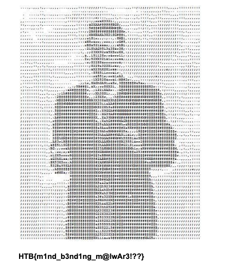


# 🏁 Solution & Commands

The final solve script is ['solver'](solver.py) which:
- finds the hostname in the pcap
- finds the Stage 1 data and `rc4 key`
- patches the binary 
- finds the Stage 2 data 
- decrypts the files


**🚩 Final Flag:** `HTB{m1nd_b3nd1ng_m@lwAr3!??}`

