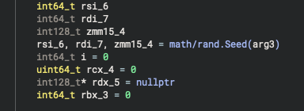
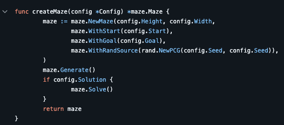
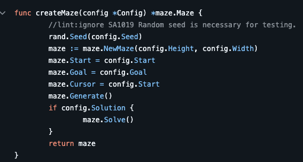
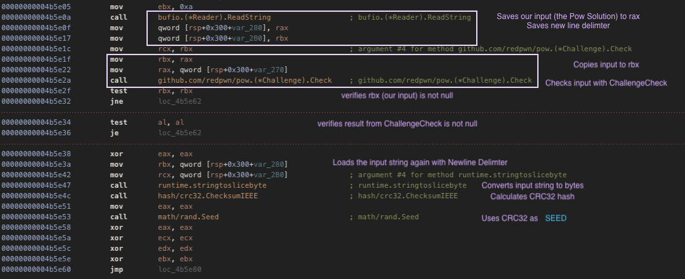
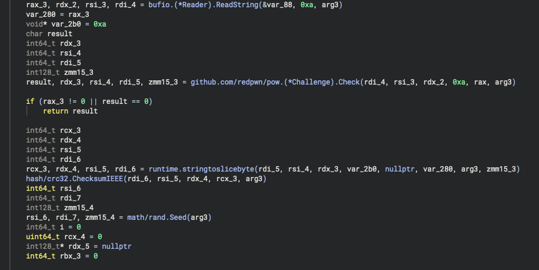
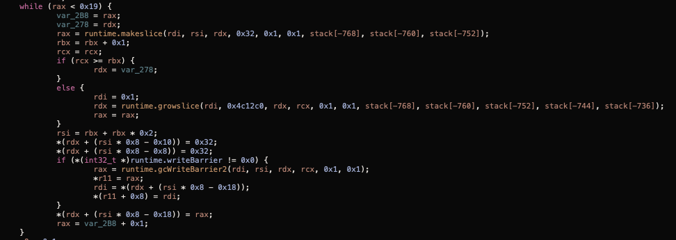
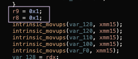
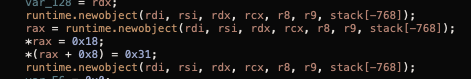
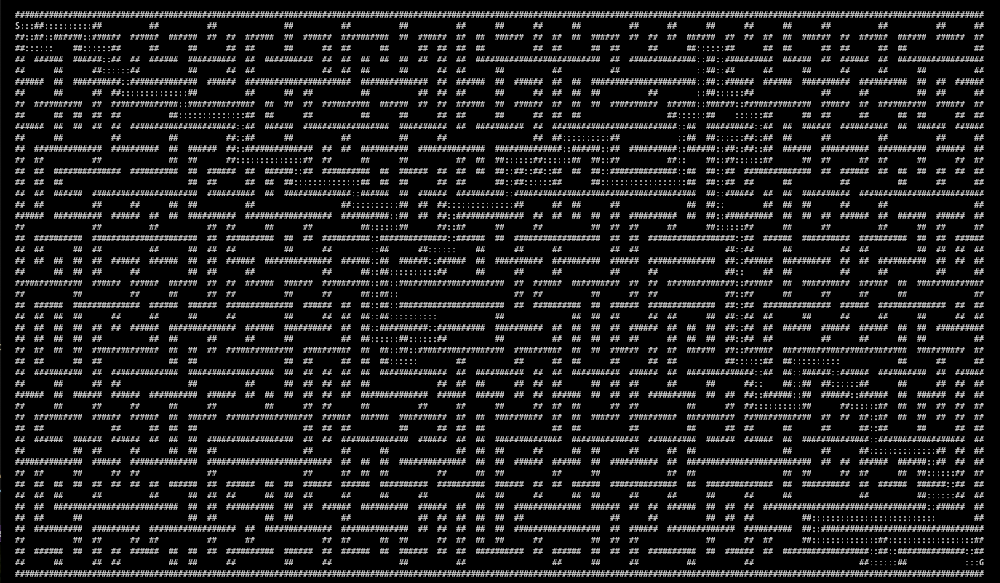

# 🔁 Reversing Challenge

## 🏷️ Name: [MazeOfPower](https://app.hackthebox.com/challenges/696)

## 🔥 Difficulty: Hard

## 🎯 Points: 0

## ⏳ Status: 🟥 Retired

## 📜 Challenge Description: 
> You&#039;ve come across a great labyrinth, which must be completed in a short time lest you be locked in forever. Luckily, you have secret contacts with the shadowy organizers of the Fray and have learned that there lies a hidden backdoor through the maze...

## 📂 Provided Files:
- **Filename:** `MazeOfPower.zip`

- **SHA-256 Hash:** `c7dbde5cab10234890a1e5b6e57bb1d246500145c2131113370350f3778f4ba7`

# 🚀 Methodology

### 🔁 1️⃣ Decompiling & Analyzing the Binary

At first I wanted to **CRY** when I saw that it was a go binary because I find them to be such a pain to disassemble. But thankfully it wasn't stripped and had `debug_info`. 

If we look at the `main.main` function. we see that it uses : `github.com/redpwn/pow.GenerateChallenge`, so the server will likely ask us to solve a proof-of-work before doing anything useful.

It also uses `github.com/itchyny/maze.(*Maze).Generate` ; which is clearly the core of the challenge/game logic.


The first thing I noticed is that the RNG is initalized with an argument: 



math.rand in RNG is honestly a *hot garbage* as an RNG, and easily reproducible. For a previous CTF, I had 'pythonized' the RNG, so you will find my *python implementation* of it [here](py_maze/random_rng.py). 

But if we check the [repo](https://github.com/itchyny/maze/blob/main/cmd/maze/action.go):



The RNG seems secure; it's using `math/rand/v2`, which is different from the RNG mentioned in the binary. However, when diving deeper, I noticed that the binary is actually using an older version of the repo:

```bash

strings main | grep maze

```

and one of the lines was:

`/go/pkg/mod/github.com/itchyny/maze@v0.0.9/maze.go`. 

Now if we check this version, we see that the `action.go` file initializes the RNG with `math/rand`; the vulnerable rng. 




Based on the source code, we need to also figure out: 
- the dimensions of the maze (height and width)
- the seed used (clearly this is crucial)

The repo lets you run the binary with the `-b` flag to get the solution, and it even lets you specify the seed manually. So if we get the seed and the maze config... we can regenerate the whole maze and solve it ourselves.

---

**🔍 From the Source Code**

```go
func createMaze(config *Config) *maze.Maze {
	//lint:ignore SA1019 Random seed is necessary for testing.
	rand.Seed(config.Seed)
	maze := maze.NewMaze(config.Height, config.Width)
	maze.Start = config.Start
	maze.Goal = config.Goal
	maze.Cursor = config.Start
	maze.Generate()
	if config.Solution {
		maze.Solve()
	}
	return maze
}

```

#### 🔑 Finding the seed

In Hopper, looking at `main.main`, we can see the following:



Notice I mention how it saves `newline` delimters, this came from the disassembly in **Binary Ninja**, but I prefer the Hopper assembly tbh.




Anyway, turns out the **solution to the PoW** is used as the RNG seed. But **important detail**: it *includes the newline character*. This is very relevant if you're using pwnlib to solve this challenge. I kind of rabbit holed here because I thought it would be stripping the new line when calculating the seed 🫠... 

#### 🔑 Finding the configuration

After the seed is initialized, the binary allocates the maze:



The `while (rax < 0x19)` loop tells us that the **height is 25**. And the `makeslice` call uses `0x32`, which means the **width is 50**.


Then, we get the Start Point -> (1,1):




And then the Goal Point -> (24,49):



*Also, please don't come for me if I'm reading the disassembly wrong lol but this made perfect sense to me 😅.*.

Soooo we know:

- The seed is the CRC32 of the solution of the PoW challenge, **WITH** a newline.
- The binary uses an old, insecure PRNG. 
- The maze configuration is:
  - Size: **25 (height) × 50 (width)**
  - Start: **(1, 1)**
  - Goal: **(24, 49)**

--- 


### 🔍 2️⃣ Understanding the Logic Flow

I translated the Go package into Python because... what can I say, I'm a Python girlie 💅🏻 (you can check it out [here](py_maze)).


Other than trying my best to recreate the maze logic to match the Go original, I also had to implement Go’s RNG. Luckily, `math/rand` in Go is awful but also super easy to reproduce, so that part was chill.

When running the binary, it looks like it only accepts the keys `q`, `k`, `j`, `h`, and `l`, where `q` quits the game.

> *Total lie lol.*

You can also send `b` — and it will actually dump the solution! The catch is: once you send `b`, the game ends immediately and doesn’t let you interact further. This behavior comes straight from the Go source in `interactive.go`, where pressing `b` triggers a solution print and exits the game loop.

To automate solving, I modified the code so that when the maze is solved, (when you call `maze.Solve()`) it maps the solution path to the correct keypresses for movement.

```python
# Mapping of direction flags to keypresses
# {Up: 'k', Down: 'j', Left: 'h', Right: 'l'}
keyDirs = {1: 'k', 2: 'j', 4: 'h', 8: 'l'}
```

So now, as soon as I call `maze.Solve()`, it also generates the exact input string to send to the server to walk the path. 

I’m **100% sure** none of this was necessary. Realistically, I probably could’ve just compiled the original Go code, passed in the seed and solution as arguments, and parsed the output to get the correct path. But ... I'm kind of lazy and I felt like writing a parse to convert the solution path into the actual direction keypresses would be even more annoying. 

---

Here's what it looks like when you run the Go binary (compiled from the v0.0.9 GitHub repo) in the CLI:

```bash
./maze-cli --width 50 --height 25 --seed 1560454418 --solution
```



meh. I'm overstimulated just by thinking of how to parse this lol. 

--- 

### 🔑 3️⃣ Extracting the Flag

To get the flag, we need to communicate with the server and:

1. Solve the PoW challenge
2. Calculate the CRC32 of the pow challenge (including the newline !!!)
3. Create our own instance of the maze with the configurations (Seed, Height, Width, --solution)
4. Send each direction one-by-one
5. It will give us the flag in format `Here is your flag: %flag%` ! 

I also included a 'debug' version in the `solve.py` code, to verify that the solution path we're generating matches the server's (via the `b` command). 

**🚩 Final Flag:** `HTB{w1th_th3_p0w3r_0f_th3_m4z3!!1}`

